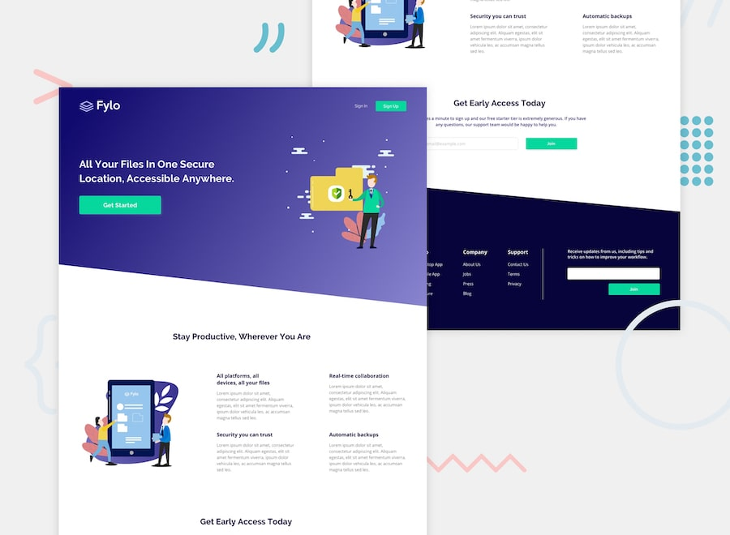

Fronted mentor is a platform that allows developers practice front-end skills by building real projects. 

The design allows experiment freely with technologies such as HTML, CSS and JavaScript. 

I usually start by determine the structure of what i will built. In this project I utilized segmetation of sass code by creating files for each section of the web page.

To integrate them all together and access variables, mixin and other styles, I have created one main.scss file where i have imported all other scss files.

In regards to building up the framework of the project people have different approces. However I like to build designs by each section. said that I started mine with the header.

## Project brief
Build a pixel perfect responsive website that works accross browsers.

### Thumbnails

## Requirements
1. Create project using Sass Segmentation
2. Use HTML5 / SCSS
3. Make it responsive using media queries when necesary

## Design
Design is available in [Frontend Mentor](https://www.frontendmentor.io) challenges allow you to improve your skills in a real-life workflow.

## Supported browsers
Ensure that the elements work and display correctly in the following browsers:

- Firefox (latest version)
- Google Chrome (latest version)
- Microsoft Edge
- Internet Explorer 11
- Safari

## Coding Standards
Utilize code, style standards.

## Project Deadline
2 Days

## Quality Assurance

Tested in all browsers and divices for quality assurance
